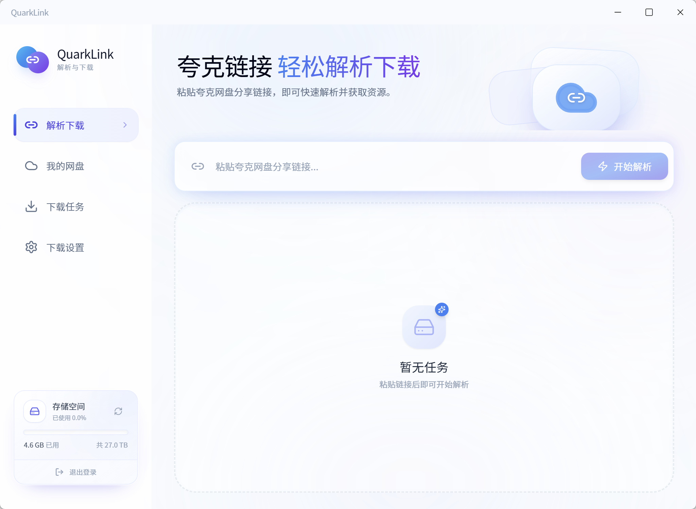
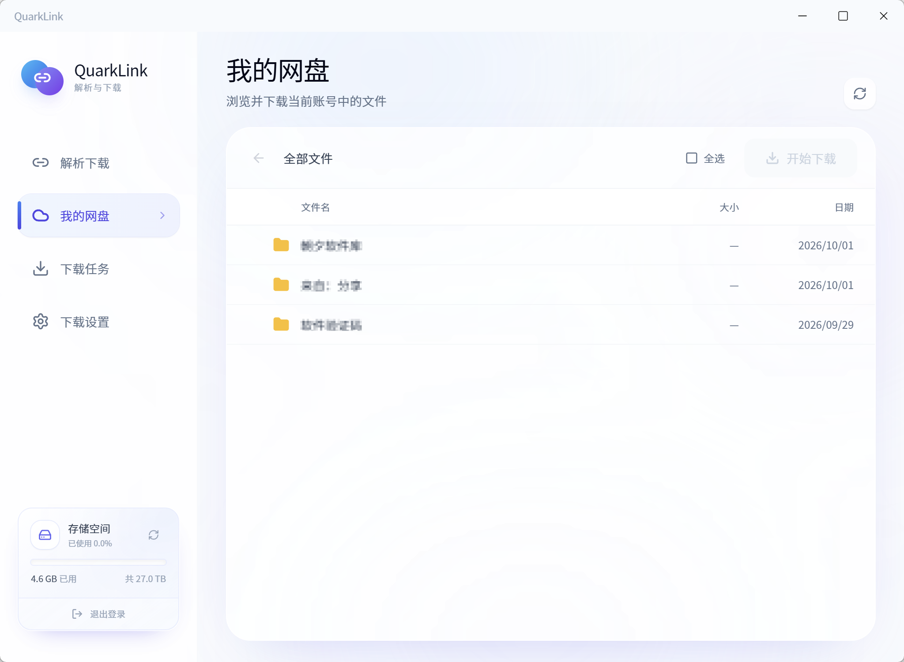
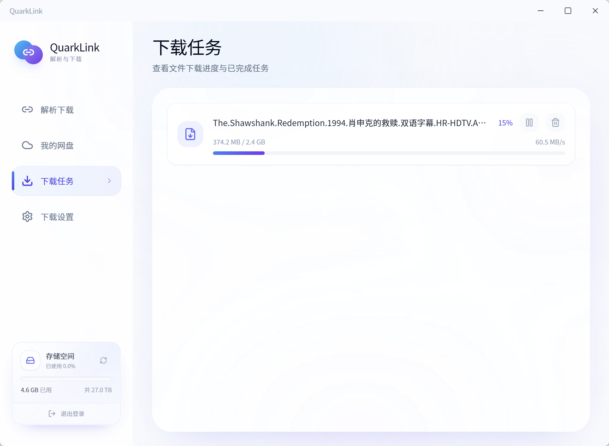
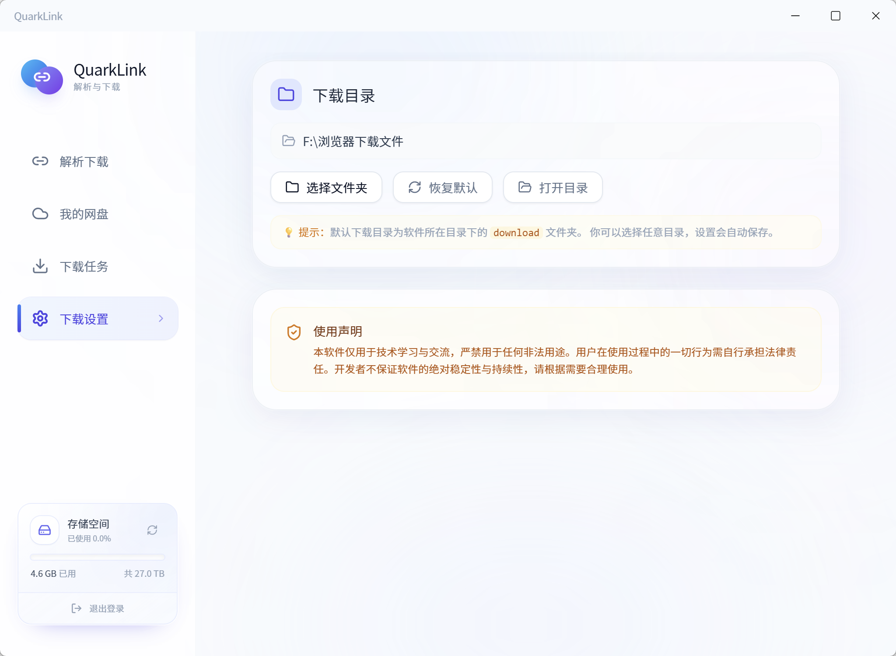

# QuarkLink · 电脑夸克网盘不限速下载工具

QuarkLink Windows 桌面下载工具的公开介绍与便携版发布仓库。支持夸克分享链接解析、我的网盘浏览、多线程分片下载与批量任务管理。

**[下载最新 Windows 便携版](https://github.com/2857865859/QuarkLionk/releases/latest)**

## 下载速度

下方实测截图显示 **60.5 MB/s** 下载速度。多线程分片下载可充分利用网络带宽；实际速度受宽带、服务器、文件大小与磁盘性能等因素影响，不保证所有环境均达到 60 MB/s。

## 功能介绍

- 分享链接解析：粘贴夸克网盘分享链接，解析文件和目录，选择所需文件下载。
- 我的网盘：浏览当前账号中的文件，选择文件批量下载。
- 多线程分片：大文件使用 HTTP Range 并行分片下载，小文件使用单线程下载。
- 批量任务：支持多个文件并发下载，查看进度和实时速度，暂停或删除任务。
- 下载设置：自定义下载目录，打开目录或恢复默认设置。
- 登录与容量：支持扫码登录或 Cookie 登录，展示网盘存储空间。
- 绿色便携：解压后运行 QuarkLink.exe，无需安装程序。

## 使用步骤

1. 在 [Releases](https://github.com/2857865859/QuarkLionk/releases/latest) 的 **Assets** 中下载便携版 ZIP。GitHub 自动生成的 Source code 压缩包不是软件安装包。
2. 将 ZIP 完整解压到有写入权限的文件夹。
3. 双击 `QuarkLink.exe`，按界面提示登录。
4. 粘贴分享链接，或进入“我的网盘”选择文件并下载。
5. 如出现验证码提示，按软件界面提示完成验证。

Windows 运行环境需要 Microsoft Edge WebView2 Runtime。默认下载目录为程序同级的 `download` 文件夹，可在下载设置中修改。

## 界面截图

### 分享链接解析

### 我的网盘

### 下载任务 · 60.5 MB/s

### 下载设置

